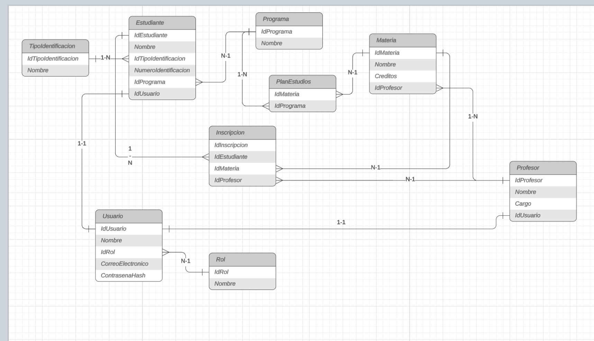

# Registro de Estudiantes

Registro en línea de estudiantes a un programa de créditos.
.NET 10 · Angular 22 · SQL Server · arquitectura hexagonal con DDD.

## Ejecutar

**1. Base de datos.** Ejecutar `database/01_RegistroEstudiantes.sql`. Crea la base, las tablas y el catálogo. Es re-ejecutable.

**2. API.** Ajustar `Server=` en `src/RegistroEstudiantes.Api/appsettings.json` (para SQL Express: `localhost\\SQLEXPRESS`) y:

```bash
dotnet dev-certs https --trust
dotnet run --project src/RegistroEstudiantes.Api --launch-profile https
```

Documentación en `https://localhost:7001/scalar/v1`. Al arrancar se crean los usuarios de prueba.

**3. Web.**

```bash
cd registro-estudiantes-web
npm install
ng serve
```

`http://localhost:4200`

**Pruebas:** `dotnet test`

## Usuarios de prueba

Contraseña de los estudiantes: `Estudiante2026*`

| Correo | Qué muestra |
|---|---|
| `juan.perez@registro.edu.co` | Tiene Cálculo con Laura Gómez: Álgebra Lineal queda bloqueada |
| `ana.torres@registro.edu.co` | Cupo lleno (3 materias) |
| `maria.rodriguez@registro.edu.co` | Comparte clases con Ana y Juan |
| `camila.vargas@registro.edu.co` | Sin materias |
| `admin@registro.edu.co` / `Admin2026*` | Administrador |

## Modelo de datos



## Reglas

| Regla | Dónde se cumple |
|---|---|
| Máximo 3 materias | `Estudiante.InscribirMateria` (dominio) |
| No repetir profesor | Dominio + `UNIQUE (IdEstudiante, IdProfesor)` + FK compuesta `(IdMateria, IdProfesor)` |
| 3 créditos por materia | `CHECK (Creditos = 3)` |
| 5 profesores, 2 materias cada uno | FK `Materia.IdProfesor` + catálogo |
| Ver registros de otros | `GET /api/registros`: sin documento ni correo |
| Solo nombres de compañeros | `GET /api/mi-registro` |

Cada regla se valida primero en el dominio, con un mensaje claro, y la base de datos es la última barrera.

## Arquitectura

```
src/
  Domain           reglas de negocio, sin dependencias
  Application      casos de uso y puertos
  Infrastructure   EF Core, hash, JWT
  Api              controllers, composition root
tests/             pruebas del dominio
database/          scripts SQL
registro-estudiantes-web/
```

Las dependencias apuntan hacia `Domain`. Cambiar de motor de base de datos solo toca `Infrastructure`.

## Decisiones

- `Estudiante` es la raíz del agregado: con él solo se tienen todos los datos para aplicar las reglas.
- El script SQL es la fuente de verdad del esquema; EF Core lo mapea sin migraciones.
- `Inscripcion` copia el profesor de la materia para que la base pueda proteger la regla del profesor.
- Escrituras por el agregado; lecturas directas a DTO.
- Contraseñas con PBKDF2 + salt. El login responde igual si falla el correo o la contraseña.
- El Id del estudiante sale del token, nunca de la URL.
- Errores en formato ProblemDetails, sin `try/catch` en los controllers.
- Usuarios de prueba creados con los mismos casos de uso de la app.
- La clave JWT de desarrollo está en `appsettings.Development.json` para ejecutar sin configurar nada; en producción iría en variables de entorno.
- Angular: Signals para el estado, Observables para las peticiones y eventos. Componentes standalone con `OnPush`. La interfaz guía (deshabilita y explica), pero la API decide.

## Supuestos

- Hay varios programas, cada uno con su plan de estudios; una materia puede estar en varios.
- Solo se inscriben materias del plan del propio programa.
- El programa no se cambia al editar los datos.
- Los profesores no inician sesión.
- Login con correo; contraseña de mínimo 8 caracteres.
